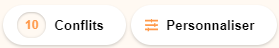
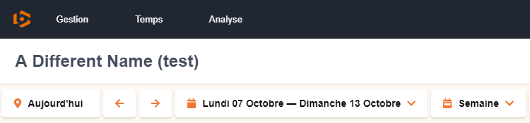

## Available Scripts

In the project directory, you can run:

### `yarn start`

Runs the app in the development mode.

### `re-usable components`

 

CalendarButton.js takes Icon1, Icon2, and title as props. Icon1 will display on the left hand side of the title, Icon2 will appear on the right side. Title is not mandatory.

CalenderButtonAlt.js takes title, counter, and Icon as props. edges are more curved than CalendarButton and can not take two Icons as props. title is a mandatory string, and counter is an integer passed through props.

ScheduleCard.js takes an individual appointment object as props and displays the information with data that it parses from the object. ScheduleCard conditionally renders depending on whether or not the isLate prop is true or false and whether or not all fields have been fulfilled or not (isComplete).

NumBox.js is a component used in the footer as well as the CollaboratorBar. it takes a value prop which displays the number value that it is expecting.

Avatar.js takes a userAvatar as props. renders an image.

HeaderButton.js takes link and title as props. the HeaderButton displays title value and on click will take you to a url based on the link prop.

AppointmentContainer.js is a responsive component that takes data for a whole day as props, will map through the various objects within an array which is the dataset and return individual appointment cards per appointment object in the dataset.

Day.js takes day, number and isActive as props. day is a string that displays the name of the day of the week, number is a value of the numerical day of the week, isActive if true will render the day cell as active, with orange styling.

Month.js takes a month string value and returns the month component displaying the month.

### `Other Notes and Suggestions`

When a user hovers over an individual AppointmentContainer component, the AddAppointmentCard component will render underneath.

The title of the page is an input with its value set as a local state, so when the user changes the name of the organizer it could be sent with a POST to a database allowing users to have many unique organizers.

Would love to see functionality to share certain schedule cards, full days or weeks of appointments to other users on the team. A button could be added to the ScheduleCard to allow sharing.
